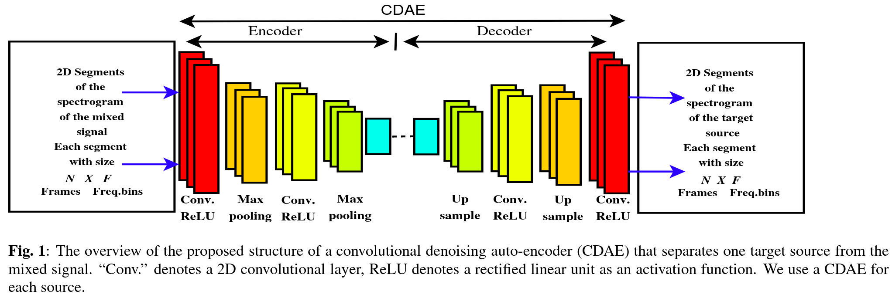
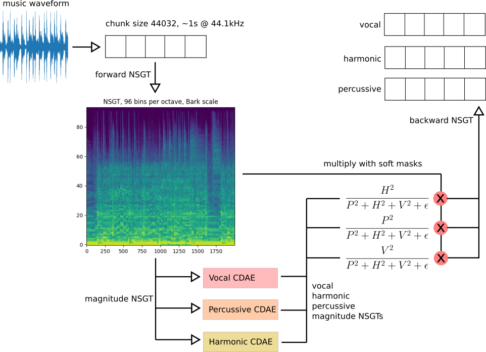
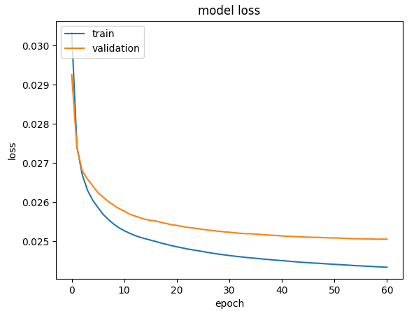
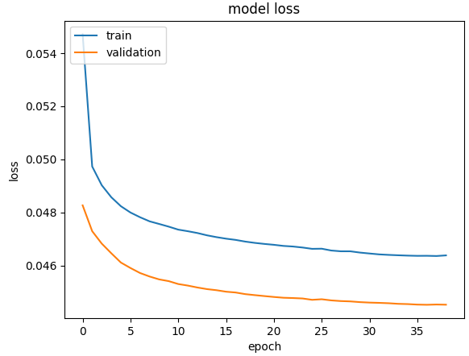
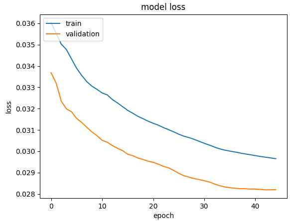
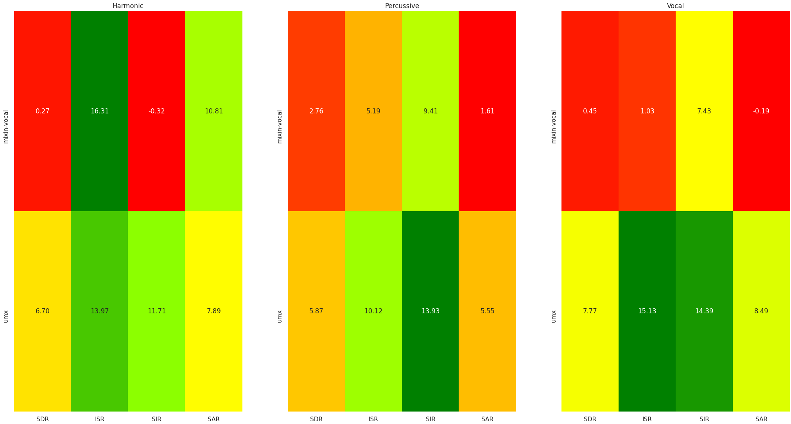

# MiXiN

MiXiN, or **M**usic **X**traction with **N**onstationary Gabor Transforms, is a model for harmonic/percussive/vocal source separation based on [Convolutional Denoising Autoencoders](https://arxiv.org/abs/1703.08019). The pretrained models are trained on Periphery stems from the albums Juggernaut, Omega, Periphery III, and Hail Stan (available for purchase [here](https://store.periphery.net/music/music)).

MiXiN takes the simple [median-filtering HPSS](http://dafx10.iem.at/papers/DerryFitzGerald_DAFx10_P15.pdf) algorithm (which applies soft masks computed from harmonic and percussive magnitude estimates), replaces the STFT with an NSGT using 96 bands on the Bark frequency scale (from 0-22050Hz), and replaces the simple (but not so impressive) median filtering estimation step with trained CDAEs.

MiXiN has only been tested on my own Linux computer - if you experience any issues, or need help getting it running somewhere else, feel free to use GitHub issues to ask or suggest anything.

## Install and use

To install MiXiN, use the requirements.txt file (probably with a virtualenv, your choice):

```
$ pip install -r ./requirements.txt
```

If you want to use MiXiN to separate songs, run the `xtract_mixin.py` script:

```
$ ls *.wav
mixed.wav
$ ./xtract_mixin.py ./mixed.wav
$ ls *.wav
mixed_harmonic.wav  mixed_percussive.wav  mixed_vocal.wav  mixed.wav
```

There are two flags that affect the quality of separation:
* `--single-model` uses the original CDAE strategy of using the network output magnitude + original mix phase to invert and create the separations. The default uses all 3 models to create per-component soft masks.
* `--instrumental` ignores the vocal model. Useful for instrumental metal songs; you may get slightly better outputs.

If you want to use MiXiN in your own code, take a look at `xtract_mixin.py` to see how it calls the mixin library. You'll know the pretrained models are loaded correctly if you see 3 different sets of Keras layers printed:
```
Loading models from:
        /home/sevagh/repos/MiXiN/./pretrained-models/model_harmonic.h5
        /home/sevagh/repos/MiXiN/./pretrained-models/model_percussive.h5
        /home/sevagh/repos/MiXiN/./pretrained-models/model_vocal.h5
...

Model: "sequential"
_________________________________________________________________
Layer (type)                 Output Shape              Param #
=================================================================
conv2d (Conv2D)              (None, 96, 1948, 12)      120
...

_________________________________________________________________
Model: "sequential_1"
_________________________________________________________________
Layer (type)                 Output Shape              Param #
=================================================================
conv2d_8 (Conv2D)            (None, 96, 1948, 12)      120
_________________________________________________________________
...

_________________________________________________________________
Model: "sequential_2"
_________________________________________________________________
Layer (type)                 Output Shape              Param #
=================================================================
conv2d_16 (Conv2D)           (None, 96, 1948, 12)      120
...
cropping2d_2 (Cropping2D)    (None, 96, 1948, 1)       0
=================================================================
Total params: 37,005
Trainable params: 37,005
Non-trainable params: 0
...
Writing harmonic and percussive audio files
Writing vocal audio files
Done
```

## Architecture

MiXiN uses 3 CDAEs, each trained on separate harmonic, vocal, and percussive components.

From the paper on [CDAEs for source separation](https://arxiv.org/abs/1703.08019):


The CDAE paper uses an STFT of 15 frames with a window size of 1024 (1025 FFT points, representing 2048/2 + 1 non-redundant spectral coefficients) to perform source separation, by training a separate CDAE for each source. One CDAE is recommended for each desired source. In MiXiN, the sources considered are harmonic/percussive/vocal - this is influenced by the [median-filtering HPSS](http://dafx10.iem.at/papers/DerryFitzGerald_DAFx10_P15.pdf) and [HPSS vocal separation with CQT](https://arrow.tudublin.ie/cgi/viewcontent.cgi?article=1007&context=argart) papers. This gives us an architecture with 3 CDAEs.

In MiXiN, the Nonstationary Gabor Transform is used with 96 bands on the Bark scale from 0-22050 Hz using [my fork](https://github.com/sevagh/nsgt) of the Python [nsgt](https://github.com/grrrr/nsgt) library. Think of the NSGT like an STFT with some useful time-frequency properties that might make it more amenable to musical applications - for further reading more musical time-frequency analyses, check out [Judith Brown's first paper on the CQT](https://www.ee.columbia.edu/~dpwe/papers/Brown91-cqt.pdf), [Monika Doerfler's dissertation](http://www.mathe.tu-freiberg.de/files/thesis/gamu_1.pdf) for a treatment of multiple Gabor dictionaries, and [paper 1](https://ltfat.github.io/notes/ltfatnote010.pdf), [paper 2](https://ltfat.github.io/notes/ltfatnote018.pdf) on NSGTs.

The signal is split into chunk sizes of 44032 samples (representing roughly 1s of audio, divisible by 1024), and a forward NSGT is done on each chunk. The magnitude of the mixed audio NSGT coefficients per chunk is the input to all of the 3 CDAEs, and the outputs are the estimates of vocal, percussive, and harmonic magnitude NSGT coefficients.

The original CDAE paper uses the phase of the mixture and the magnitude of the CDAE output to invert and create the separated source. The approach in MiXiN is closer to that of the HPSS formulation, where the magnitude estimates of each source (harmonic, percussive, vocal) are used to compute soft masks using the Wiener filter formula:



Finally, the NSGT coefficient matrix of the original mixed chunk is multiplied with the respective mask and the backward NSGT gives us the harmonic, percussive, and vocal chunks (appended to the full track output).

## Training

As mentioned, the training data used was 4 albums from Periphery, prepared in two sets:
* Instrumental mix, harmonic (rhythm guitar + lead guitar + bass + other stems), and percussive (drum stem)
* Full mix, harmonic (rhythm guitar + lead guitar + bass + other stems), and percussive (drum stem), vocal (vocal stem)

A consequence is that the vocal CDAE is trained on half the data of the percussive and harmonic ones.

The data is split into 80%/20%/20% train/validation/test. There are 3 models trained, with 37,000 parameters each. The CDAE implementation is relatively clear in the paper, but I was also helped by [this implementation](https://github.com/SahilJindal1/Sound-Separation). Here are the training plots for the 3 networks - the loss is mae.

Percussive:



Harmonic:



Vocal:



## Evaluation

A small evaluation was performed on some tracks from the [MUSDB18-HQ](https://zenodo.org/record/3338373) test set, using the testbench from my larger [Music-Separation-TF](https://github.com/sevagh/Music-Separation-TF) project (survey of various DSP approaches to source separation).

The metric is SigSep's [BSSv4](https://github.com/sigsep/bsseval), and MiXiN is compared against [Open-Unmix](https://sigsep.github.io/open-unmix/):



MiXiN scores poorly, but to me it still sounds pretty good - I like the percussive and vocal outputs more than harmonic.

## Run tests, train your own models

Run the end-to-end test (you must supply a stem dir). Pass `--delete` to automatically delete the `./data`, `./model`, and `./logdir` working directories. Use `2>/dev/null` to discard the verbose Tensorflow/Keras outputs.

The e2e test runs a full cycle through:
1. Keras CDAE layers and input/output dimensions check
2. Stem segment preparation from original stems (e.g. in MUSDB18-HQ)
3. Stem segment verification (duration, sample rate, appropriate components i.e. harmonic/percussive/vocal/mix)
4. HDF5 file creation
5. HDF5 file verification including test/train/validation sizes and NSGT input/output dimensionality 
6. Training all 3 models
7. Verifying existence of checkpoint dirs and saved h5 model files

```
$ STEM_DIR=~/TRAINING-MUSIC/MUSDB18-HQ/test/ ./test_e2e.py --delete 2>/dev/null
[MiXiN e2e test] Early sanity check - Keras model layers and dimensions...
[MiXiN e2e test] good!
[MiXiN e2e test] Deleting dirs...
[MiXiN e2e test] Checking if dirs exist... dont want to overwrite user training
[MiXiN e2e test] Checking if STEM_DIR is defined
[MiXiN e2e test] Preparing stems with train util
[MiXiN e2e test] Verifying prepared stems
[MiXiN e2e test] Verifying prepared segments for audio properties
[MiXiN e2e test] good
[MiXiN e2e test] Creating hdf5 with train util
[MiXiN e2e test] good
[MiXiN e2e test] Verifying dimensionality of hdf5 files
[MiXiN e2e test] good
[MiXiN e2e test] Training the 3 networks
[MiXiN e2e test] Verifying training outputs
[MiXiN e2e test] finished!
```

If the e2e test succeeds, chances are MiXiN will work fine for you.

To train your own, use the `train_util.py` script.

**Step 1**, prepare stem files - example arguments are 10-second segments per track, 2 total tracks, skipping the first 3 segments, and limiting to 4 segments (total segments = 2 tracks * (4 segments - 3 segment offset) = 2):

```
# prepares 2 sets of files: harmonic/percussive/mix, suffixed "${track_sequence}nov"
#                           harmonic/percussive/vocal/mix, suffixed "${track_sequence}v"
$ ./train_util.py \
        --prepare-stems \
        --stem-dirs ~/TRAINING-MUSIC/MUSDB18-HQ/train/ \
        --segment-duration 10 \
        --segment-offset 3 \
        --track-limit 2 \
        --segment-limit 4
$ tree data/
data/
├── 0000003nov
│   ├── harmonic.wav
│   ├── mix.wav
│   └── percussive.wav
├── 0000003v
│   ├── harmonic.wav
│   ├── mix.wav
│   ├── percussive.wav
│   └── vocal.wav
├── 0010003nov
│   ├── harmonic.wav
│   ├── mix.wav
│   └── percussive.wav
└── 0010003v
    ├── harmonic.wav
    ├── mix.wav
    ├── percussive.wav
    └── vocal.wav
```

**Step 2**, prepare hdf5 data files from stems, which does the train/test/validation split (80/20/20, hardcoded):

```
$ ./train_util.py --create-hdf5
--prepare-stems not specified, skipping...
percussive chunk 0 TRAIN/TEST/VALIDATION SPLIT:
        all data: (40, 96, 3896)
        train: (32, 96, 3896)
        test: (4, 96, 3896)
        validation: (4, 96, 3896)
harmonic chunk 0 TRAIN/TEST/VALIDATION SPLIT:
        all data: (40, 96, 3896)
        train: (32, 96, 3896)
        test: (4, 96, 3896)
        validation: (4, 96, 3896)
vocal chunk 0 TRAIN/TEST/VALIDATION SPLIT:
        all data: (20, 96, 3896)
        train: (16, 96, 3896)
        test: (2, 96, 3896)
        validation: (2, 96, 3896)
--train not specified, skipping...
$ ls data/*.hdf5
data/data_harmonic.hdf5  data/data_percussive.hdf5  data/data_vocal.hdf5
```

The dimensionality of the data is 96 x (2 * 1948), representing 2 concatenated NSGTs, one for the mix, and one for the source. There are 2 segments (20s of audio total), which is split into chunks of ~1s before taking the NSGT. Vocal has half the data of harmonic/percussive since the same track is made into an instrumental and vocal mix.

**Step 3**, train the networks, which store checkpoints in `logdir` and the trained model in `model`. Use `--plot-training` to view training plots (this will block until you exit matplotlib, so you can't fire-and-forget with `--plot-training`). It will print the MAE/loss for train, test, and validation (for each model) before exiting:

```
$ ./train_util.py --train
$ ls logdir/
model_harmonic.ckpt  model_percussive.ckpt  model_vocal.ckpt
$ ls model/
model_harmonic.h5  model_percussive.h5  model_vocal.h5
```

Models are saved as h5 files.

**Step 4**, use your custom models by passing `--pretrained-model-dir` in the `xtract_mixin.py` script:

```
$ ./xtract_mixin.py --pretrained-model-dir=./model mixed.wav
Loading models from:
        ./model/model_harmonic.h5
        ./model/model_percussive.h5
        ./model/model_vocal.h5
...
```
